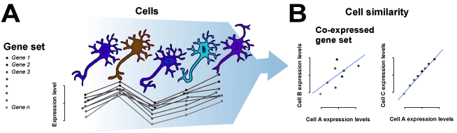
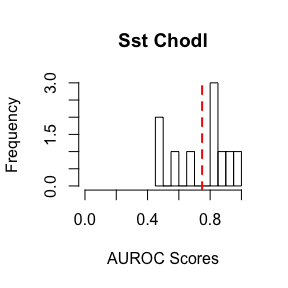

MetaNeighbor: a method to rapidly assess cell type identity using both functional and random gene sets
================
Megan Crow, Anirban Paul, Sara Ballouz, Josh Huang, Jesse Gillis

March 1, 2018

-   [Introduction](#introduction)
-   [Data types](#data-types)
    -   [Supervised](#supervised)
    -   [Unsupervised](#unsupervised)
-   [System requirements/estimated run times](#system-requirementsestimated-run-times)
-   [Methods](#methods)
-   [Part 1: Supervised MetaNeighbor](#part-1-supervised-metaneighbor)
    -   [Quick start](#quick-start)
    -   [More detail](#more-detail)
        -   [Install data and R functions](#install-data-and-r-functions)
        -   [Run MetaNeighbor](#run-metaneighbor)
        -   [Plot results](#plot-results)
-   [Part 2: Unsupervised MetaNeighbor](#part-2-unsupervised-metaneighbor)
    -   [Quick start](#quick-start-1)
    -   [More detail](#more-detail-1)
        -   [Install data and R functions](#install-data-and-r-functions-1)
        -   [Identify a high variance gene set](#identify-a-high-variance-gene-set)
        -   [Run Unsupervised MetaNeighbor](#run-unsupervised-metaneighbor)
        -   [Plot results](#plot-results-1)
        -   [Identify reciprocal top hits and high scoring cell type pairs](#identify-reciprocal-top-hits-and-high-scoring-cell-type-pairs)

Introduction
============

The purpose of this method is to measure the similarity of cells across single cell RNA-sequencing (scRNA-seq) datasets by sampling from both random and functionally defined gene sets. MetaNeighbor works on the basis that cells of the same type should have more similar gene expression profiles than cells of different types. In other words, when we compare the expression profile between T-cells and hepatocytes for a given gene set, we should see higher correlations among all T-cells than we do between T-cells and hepatocytes. This is illustrated in the schematic below:



In our approach, this is formalized through neighbor voting based on cell-cell similarities, described in more detail in our paper: 

Crow M, Paul A, Ballouz S, Huang ZJ and Gillis J (2018) Characterizing the replicability of cell types defined by single cell RNA-sequencing data using MetaNeighbor, Nature Communications (9) 884 

In short, MetaNeighbor takes four inputs: a gene-by-sample expression matrix (“data”), a set of labels indicating each sample’s dataset of origin (“experiment labels”), a set of labels indicating each sample’s cell type (“cell type labels”) and a set of genes (“gene sets”). The output is a performance vector (“AUROC scores”), which is the mean area under the receiver operator characteristic curve (AUROC) for the given task. This score reflects our ability to rank cells of the same known type higher than those of other types within a dataset, and can be interpreted as the probability that we will be correct about making a binary classification for a given cell (e.g. neuron vs. non-neuronal cell). An AUROC score of 0.5 means that we have performed as well as if we had randomly guessed the cell’s identity.

This is a fully supervised analysis, and requires knowledge of the corresponding cell types across datasets. However, we have also used some heuristic measures to identify cell types across datasets when labels may be ambiguous or uninformative. We will walk through this unsupervised analysis in Part 2 of the vignette.

Data types
==========

Supervised
----------

MetaNeighbor requires four inputs:

1.  A gene-by-sample expression matrix (“data”)
2.  A numerical vector that indicates the source of each sample (“experiment labels”)
3.  A matrix that indicates the cell type of each sample (“cell type labels”)
4.  Gene sets of interest (“gene sets”) provided as a list of vectors

There are three outputs of the method:

1.  A vector of AUROC scores representing the mean for each gene set tested is returned directly
2.  A list containing the AUROC score for each dataset and cell type can be found in the first output file
3.  A matrix containing the means for each cell type across datasets can be found in the second output file

Unsupervised
------------

Unsupervised Metaneighbor requires four inputs:

1.  A gene-by-sample expression matrix (“data”)
2.  A sample metadata table, that lists the dataset and cell type for each sample (“pheno”)
3.  A vector that lists the names of all cell types (“celltypes”)
4.  A set of high variance genes (“var.genes”)

The output of the method is a cell type-by-cell type matrix containing average AUROC scores for each pair of cell types.

For MetaNeighbor to run, it is critical that genes within gene sets match the gene names of the expression matrix, that gene sets contain more than one gene, and that the row names of the cell type label object match the column names of the expression matrix.

System requirements/estimated run times
=======================================

Because there is a ranking step, the code is not ideal for scaling in the R environment as is. The major factor is the total number of samples. Speed-ups are possible with parallelization and installing libraries such as MRAN (<https://mran.revolutionanalytics.com/>).

Laptop (OSX 10.10.4, 1.6 GHz, 8GB RAM, R 3.3.2, Rstudio 0.99.446)

|  Experiments|  Cell types|  Samples|  Gene sets|  Time (s)|
|------------:|-----------:|--------:|----------:|---------:|
|            2|           1|      100|         10|       0.1|
|            2|          10|      100|         10|       0.5|
|            2|          10|      100|        100|       1.7|
|            2|          10|      100|       1000|      17.5|
|            2|           1|     1000|         10|         9|
|           10|           1|     1000|         10|         9|
|            2|          10|     1000|         10|        12|
|            2|          10|     1000|        100|        93|
|            2|          10|     1000|        100|       979|
|            2|          10|    10000|         10|      3653|

Methods
=======

MetaNeighbor runs as follows: first, we build a network of rank correlations between all cells for a gene set. Next, the neighbor voting predictor produces a weighted matrix of predicted labels by performing matrix multiplication between the network and the binary vector indicating cell type membership, then dividing each element by the null predictor (i.e., node degree). That is, each cell is given a score equal to the fraction of its neighbors (including itself), which are part of a given cell type. For cross-validation, we permute through all possible combinations of leave-one-dataset-out cross-validation, and we report how well we can recover cells of the same type as area under the receiver operator characteristic curve (AUROC). This is repeated for all folds of cross-validation, and the mean AUROC across folds is reported.

Part 1: Supervised MetaNeighbor
===============================

Quick start
-----------

To run through the analysis and plot results, simply download the R functions and example data [here](https://github.com/maggiecrow/MetaNeighbor) and load them into your R session:

``` r
source("2016-11-03-runMetaNeighbor.R")
load("MetaNeighbor_sample_data.Rdata")
AUROC.scores = run_MetaNeighbor(data = data, experiment_labels = exp.lab, celltype_labels = cell.lab, genesets = genesets, file_ext="filename")
hist(AUROC.scores,main="Sst Nos",xlab="AUROC Scores",breaks=20,xlim=c(0,1))  
abline(v=mean(AUROC.scores),col="red",lty=2,lwd=2)
```

More detail
-----------

We have provided sample data, as well as sample gene sets on our [Github site](https://github.com/maggiecrow/MetaNeighbor). In this sample data, we have included the cortical interneurons from two public datasets, GSE60361 and GSE71585 (RPKM). A subset of ~3000 genes and 10 genesets have been included for demonstration. For this example, we will be testing how well we can identify the Sst and Nos expressing subtypes, Sst-Chodl from GSE71585 and Int1 from GSE60361, relative to all other interneurons within their respective experiments.

### Install data and R functions

To run through the analysis, first download the R functions and example data from our [Github site](https://github.com/maggiecrow/MetaNeighbor) and load them into your R session:

``` r
source("2016-11-03-runMetaNeighbor.R")
load("MetaNeighbor_sample_data.Rdata")
```

### Run MetaNeighbor

MetaNeighbor has three outputs, two of which will be written out to external files. Specify the desired path and file name using the file\_ext variable (e.g. “filename”)

As MetaNeighbor runs, it outputs a number indicating the gene set that is being currently evaluated. When all gene sets have been tested, MetaNeighbor will return a vector of scores representing the mean for each. A list containing the AUROC score for each dataset, cell type and gene set can be found in the “filename.IDscore.list.Rdata” file that will be saved, and matrix containing the mean score for each cell type can be found in “filename.IDscore.matrix.Rdata”.

``` r
AUROC.scores = run_MetaNeighbor(data = data, experiment_labels = exp.lab, celltype_labels = cell.lab, genesets = genesets, file_ext="filename")
```

    ## [1] 1
    ## [1] 2
    ## [1] 3
    ## [1] 4
    ## [1] 5
    ## [1] 6
    ## [1] 7
    ## [1] 8
    ## [1] 9
    ## [1] 10

``` r
head(AUROC.scores)
```

    ## GO:0016853 GO:0005615 GO:0005768 GO:0007067 GO:0065003 GO:0042592 
    ##  0.6784072  0.9631236  0.8152228  0.5834635  0.8393333  0.8892412

### Plot results

We can plot the distribution of AUROC scores using the histogram function, indicating the mean with a red line.

``` r
hist(AUROC.scores,main="Sst Chodl",xlab="AUROC Scores",breaks=10,xlim=c(0,1))  
abline(v=mean(AUROC.scores),col="red",lty=2,lwd=2)
```



AUROC scores greater than 0.5 indicate improvement over randomly guessing the identity of the cell type of interest.

Part 2: Unsupervised MetaNeighbor
=================================

Quick start
-----------

To run through the analysis and plot results, simply download the R functions and example data from our [Github site](https://github.com/maggiecrow/MetaNeighbor) and load them into your R session:

``` r
install.packages("gplots",repos='http://cran.us.r-project.org')
install.packages("RColorBrewer",repos='http://cran.us.r-project.org')
library(gplots)
library(RColorBrewer)
source("2017-08-28-runMN-US.R")
load("MetaNeighbor_US_data.Rdata")
var.genes=get_variable_genes(data, pheno)
celltype.NV=run_MetaNeighbor_US(var.genes, data, celltypes, pheno)
get_top_hits(celltype.NV, pheno, threshold=0.9, filename="filename.txt")
```

More detail
-----------

While ideally we would like to perform supervised analyses to investigate cell type identity, in some cases it is difficult to know how cell type labels compare across datasets. For this situation, we came up with a heuristic to allow researchers to make an educated guess about overlaps without requiring in-depth knowledge of marker genes. This was based on our observation that large, high variance gene sets tended to provide improved scores for known cell types.

Unsupervised Metaneighbor requires four inputs:

1.  A gene-by-sample expression matrix (“data”)
2.  A sample metadata table, that lists the dataset and cell type for each sample with column names “Study\_ID” and “Celltype” (“pheno”)
3.  A vector that lists the names of all cell types (“celltypes”)
4.  A set of high variance genes (“var.genes”)

The output is a cell type-by-cell type mean AUROC matrix, which is built by treating each pair of cell types as testing and training data for MetaNeighbor, then taking the average AUROC for each pair (NB scores will not be identical because each test cell type is scored out of its own dataset, and the differential heterogeneity of datasets will influence scores). When comparing datasets that contained similar cell types, we found that cell types that were the best hit for one another (“reciprocal top hits”), and cell types with scores &gt;0.9 tended to be good candidates for downstream tests of cell type identity using Supervised MetaNeighbor. This rule will not hold when experiments contain wholly different cell types (e.g., comparing brain to pancreas will likely yield some spurious overlaps), or when datasets are very unbalanced with respect to one another.

### Install data and R functions

We have provided sample data and source code [here](https://github.com/maggiecrow/MetaNeighbor). To begin the analysis, simply download the data files and functions, then upload them into your R session. You will also need to install two helper packages, gplots and RColorBrewer.

``` r
install.packages("gplots",repos='http://cran.us.r-project.org')
```

    ## 
    ## The downloaded binary packages are in
    ##  /var/folders/zr/_w9s0sbs0nz95mrg8tk14xlr0000gn/T//Rtmppkxtg0/downloaded_packages

``` r
install.packages("RColorBrewer",repos='http://cran.us.r-project.org')
```

    ## 
    ## The downloaded binary packages are in
    ##  /var/folders/zr/_w9s0sbs0nz95mrg8tk14xlr0000gn/T//Rtmppkxtg0/downloaded_packages

``` r
library(gplots)
library(RColorBrewer)
source("2017-08-28-runMN-US.R")
load("MetaNeighbor_US_data.Rdata")
```

### Identify a highly variable gene set

To begin, we will use the function get\_variable\_genes, which picks the top quartile of variable genes across all but the top decile of expression bins for each dataset, then provides the intersect across datasets as the output.

``` r
var.genes=get_variable_genes(data, pheno)
head(var.genes)
```

    ## [1] "1110017D15Rik" "1190002N15Rik" "3110043O21Rik" "Aacs"         
    ## [5] "Abcb10"        "Abcb6"

``` r
length(var.genes)
```

    ## [1] 331

In this case, we return a set of 331 highly variable genes. AUROC scores depend on both gene set size and variance. If the size of the returned set is small (<200 genes) the suggested AUROC cut-off of >0.9 may not be applicable, and it may be helpful to increase the gene set size. This may be done by taking a majority rule on genes included in the highly variable sets of each dataset in the analysis (i.e., include a gene if it is highly variable in >50% of datasets). This strategy is likely to be required with an increasing number of datasets included. However, we note that if few genes are returned when using a small number of datasets (2-3), this may indicate that the datasets have different cell type compositions, or have very different gene coverage. Under these circumstances, we do not recommend the use of unsupervised MetaNeighbor. 

### Run Unsupervised MetaNeighbor

Once we have a set of highly variable genes, we can simply run an unsupervised version of MetaNeighbor using the function:

``` r
celltype.NV=run_MetaNeighbor_US(var.genes, data, celltypes, pheno)
```

### Plot results

Results can be plotted as follows:

``` r
cols=rev(colorRampPalette(brewer.pal(11,"RdYlBu"))(100))
breaks=seq(0,1,length=101)
heatmap.2(celltype.NV,trace="none",density.info="none",col=cols,breaks=breaks,cexRow=0.6,cexCol=0.6)
```


This plot shows the AUROC scores between each testing and training pair. Red indicates a higher score and blue indicates a lower score. Note that the diagonal is not equal to one. This is because of the scoring system: cell types that are ‘promiscuous’ (i.e., have broad similarity to many types) will tend to have higher node degrees in the network. Differences in degree across cell types will affect scores as predictions are standardized by this factor. Within-dataset scores are shown for visualization purposes only, and should not be used for replicability inference.

### Identify reciprocal top hits and high scoring cell type pairs

To find reciprocal top hits and those with AUROC&gt;0.9 we use the following code:

``` r
top_hits=get_top_hits(celltype.NV,pheno,threshold=0.9,filename="filename.txt")
top_hits
```

    ##    Celltype_1  Celltype_2 Mean_AUROC         Match_type
    ## 1        Int1   Sst_Chodl       0.99 Reciprocal_top_hit
    ## 2        Int7    Vip_Sncg       0.97 Reciprocal_top_hit
    ## 3       Int14       Smad3       0.97 Reciprocal_top_hit
    ## 4        Int5        Sncg       0.96 Reciprocal_top_hit
    ## 5       Int10   Vip_Parm1       0.95 Reciprocal_top_hit
    ## 6        Int2   Sst_Cbln4       0.95 Reciprocal_top_hit
    ## 7       Int15   Ndnf_Car4       0.94 Reciprocal_top_hit
    ## 8       Int10  Vip_Mybpc1       0.93          Above_0.9
    ## 9       Int14        Igtp       0.92          Above_0.9
    ## 10       Sncg        Int6       0.92          Above_0.9
    ## 11  Ndnf_Car4       Int16       0.92          Above_0.9
    ## 12      Int12 Ndnf_Cxcl14       0.91 Reciprocal_top_hit
    ## 13 Vip_Mybpc1        Int9       0.91          Above_0.9
    ## 14   Vip_Sncg        Int8       0.91          Above_0.9
    ## 15       Int3 Pvalb_Obox3       0.81 Reciprocal_top_hit

These top hits can then be used for supervised analysis, making putative cell type labels for each unique grouping (see Part 1).

For any assistance reproducing analyses please contact mcrow@cshl.edu or jgillis@cshl.edu. For updates please refer to http://www.github.com/gillislab/MetaNeighbor.

###### under construction
